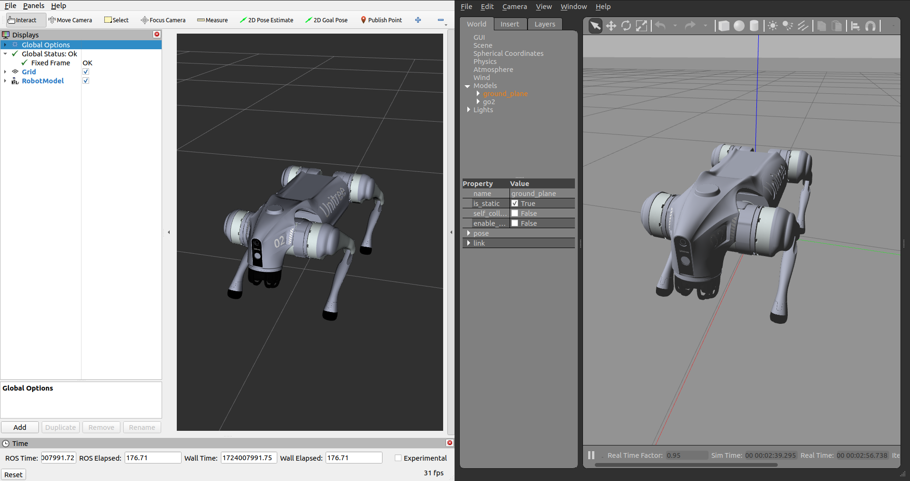
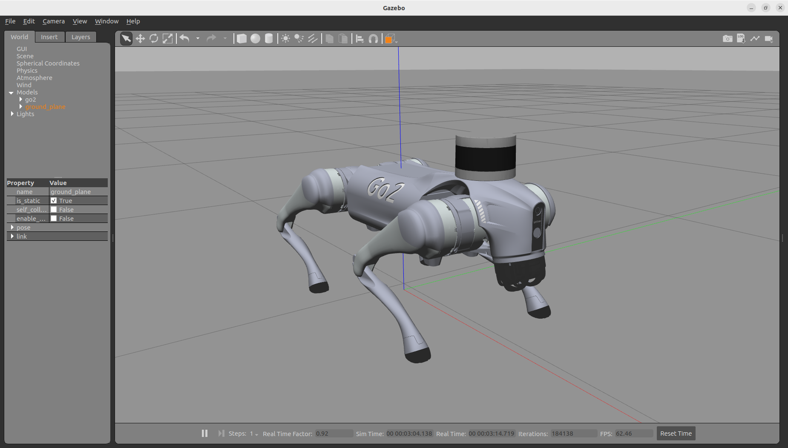
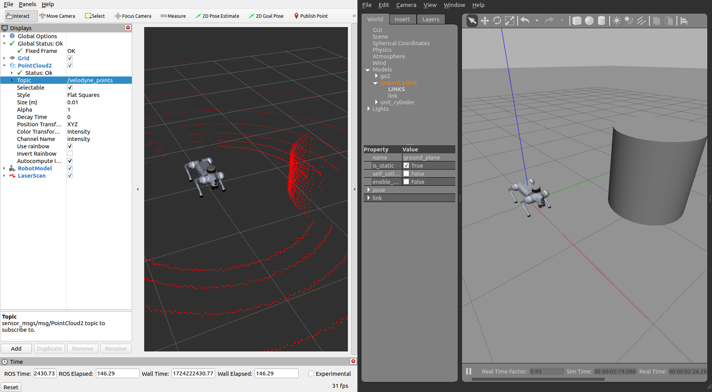

# unitree go2 ros2 - champ config

> 该软件包包含适用于 ROS 2 Humble 版本中使用 CHAMP 控制器的 Unitree Go2 机器人配置文件。它包括配置包的开发，以及机器人描述模型在 ROS 2 Humble 发行版中的升级。 Ubuntu 22.04 (ROS2 Humble)
>
> 

## 1. Installation

### 1.0 安装依赖
```bash
sudo apt install ros-humble-gazebo-ros2-control
sudo apt install ros-humble-xacro
sudo apt install ros-humble-robot-localization
sudo apt install ros-humble-ros2-controllers
sudo apt install ros-humble-ros2-control
sudo apt install ros-humble-velodyne
sudo apt install ros-humble-velodyne-gazebo-plugins
sudo apt-get install ros-humble-velodyne-description
```

### 1.1 克隆项目&&安装依赖

```bash
sudo apt install -y python3-rosdep
rosdep update

cd <your_ws>/src
git clone https://github.com/CTGUMARK/unitree-go2-ros2.git
cd <your_ws>
rosdep install --from-paths src --ignore-src -r -y
```

### 1.2 编译
```bash
cd <your_ws>
colcon build
. <your_ws>/install/setup.bash
```
## 2. 快速开始

运行以下演示不需要实体机器人。请确保你的 ROS 2 环境中已安装 `ros2_control`、`gazebo_ros` 和 `controller_manager` 等相关软件包。


### 2.1 Gazebo 演示：运行 Gazebo 模拟环境：
```bash
ros2 launch go2_config gazebo.launch.py
```


### 2.2 RViz 中的行走演示：同时运行 Gazebo 与 RViz：
```bash
ros2 launch go2_config gazebo.launch.py rviz:=true
```


### 2.3 运行遥控节点:
```bash
ros2 run teleop_twist_keyboard teleop_twist_keyboard
```
### 2.4Go2 Velodyne 配置 Gazebo 演示：运行 Gazebo 模拟环境
```bash
ros2 launch go2_config gazebo_velodyne.launch.py 
```


### 2.5 Go2 Velodyne 配置 — 行走 / 点云演示（RViz + Gazebo）：运行 Gazebo 与 RViz 联合环境
```bash
ros2 launch go2_config gazebo_velodyne.launch.py rviz:=true
```

> Note: set point cloud topic to `/velodyne_points`



### 2.6 Go2 Hokuyo 2D 激光雷达配置 Gazebo 演示：运行 Gazebo 模拟环境

> 注意：如果想使用激光雷达（Laser）替代 3D Velodyne LiDAR，请打开位于 `robots/description/go2_description/xacro/` 文件夹内的 `robot_VLP.xacro` 文件，进行如下修改： `<xacro:include filename="$(find go2_description)/xacro/laser.xacro"/>` in `robot_VLP.xacro` file located inside `robots/description/go2_description/xacro/` folder.

```bash
ros2 launch go2_config gazebo_velodyne.launch.py 
```

To Run the gazebo along with rviz
```bash
ros2 launch go2_config gazebo_velodyne.launch.py rviz:=true
```

## 3. 调整步态参数

机器人步态配置文件位于： <my_robot_config>/gait/gait.yaml.


- **膝盖方向（Knee Orientation）** — 膝盖的弯曲方向。可以配置机器人遵循以下方向模式：`.>>`、`.><`、`.<<`、`.<>`，其中点号（`.`）表示机器人的前方。
- **最大线速度 X（Max Linear Velocity X）**（米/秒）— 机器人前进或后退的最大速度。
- **最大线速度 Y（Max Linear Velocity Y）**（米/秒）— 机器人侧向移动的最大速度。
- **最大角速度 Z（Max Angular Velocity Z）**（弧度/秒）— 机器人旋转的最大速度。
- **支撑时间（Stance Duration）**（秒）— 每条腿在行走时踩地的持续时间。如果不确定，可以设置默认值 `0.25`。支撑时间越长，机器人每步移动距离相对于参考点越远。
- **摆腿高度（Leg Swing Height）**（米）— 摆动相位时腿部轨迹的最高点高度。
- **支撑高度（Leg Stance Height）**（米）— 支撑相位时腿部轨迹的最低点高度。
- **机器人行走高度（Robot Walking Height）**（米）— 机器人臀部到地面的距离。注意，设置过高可能导致机器人不稳定。
- **质心 X 方向偏移（CoM X Translation）**（米）— 用于沿 X 轴移动参考点，适用于质心不在机器人正中时进行重量补偿。例如，如果机器人后部较重，可以设置负值将参考点向后移动。
- **里程计缩放因子（Odometry Scaler）** — 用作里程计计算速度的乘数，用于补偿开环系统的里程计误差。通常取值范围为 `1.0` 到 `1.20`。


### 感谢 ：[[unitree-go2-ros2](https://github.com/anujjain-dev/unitree-go2-ros2)](https://github.com/anujjain-dev/unitree-go2-ros2.git)
